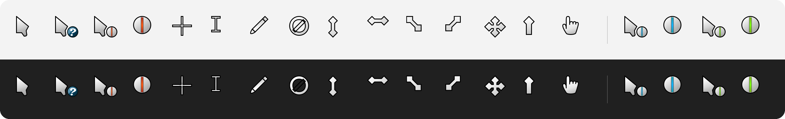

# Polar Cursor Theme — Windows 11 HiDPI cursors

Sharp at every display scale and pointer size. Built from the original vector art by
**TODO author** ([upstream](TODO)), packaged for Windows 10 1903+ / Windows 11.

## Install
1. Download the zip for your variant from [Releases](../../releases/latest) and extract it.
2. Right-click **`install.inf`** → **Install** (accept the UAC prompt — it copies to `C:\Windows\Cursors`).
3. Mouse Properties opens → choose **TODO scheme name** → **Apply**.

> Changing the pointer size in Settings can switch the scheme back to *Windows Default* — just re-select it.

**Uninstall:** run `uninstall.cmd`, pick another scheme, delete `C:\Windows\Cursors\<scheme>` as admin.

## What's embedded
| | Layers (px) |
|---|---|
| Static (`.cur`) | 32 40 48 56 64 72 80 96 112 128 144 160 192 224 256 |
| Animated (`.ani`) | 32 40 48 64 80 96 128 |

Covers pointer sizes 1–15 at 100 % and the common 125–300 % scales without resampling.
Details: [w11-cursor-toolkit docs](https://github.com/hervad/w11-cursor-toolkit).

## Why not the existing ports?
TODO: `w11cursor inspect` evidence for each existing port (layers, hotspots, roles).

## License
Artwork: TODO license (same as upstream). See [CREDITS.md](CREDITS.md) and [LICENSE](LICENSE).
